# 🧩 TeamTask - Application MERN avec Redux et gestion multi-utilisateurs 

TeamTask est une application MERN full-stack pour gérer les tâches d'équipe avec un accès basé sur les rôles. Les managers peuvent assigner des tâches, les utilisateurs peuvent les consulter et les mettre à jour. Construite avec React (Vite), Redux Toolkit, Express et MongoDB.
---

##  Fonctionnalités

- ✅ JWT Authentication (inscription, connexion)
- ✅ Accès basé sur les rôles (Manager & User)
- ✅ CRUD des tâches avec affectation
- ✅ Gestion d’état avec Redux Toolkit
- ✅ Backend MongoDB + Mongoose

---

##  Instructions d'installation

### 1. Cloner le dépôt

```bash
git clone https://github.com/yourusername/TeamTask.git
cd TeamTask
```
### 2. Configuration du backend

```bash
cd Back-TeamTask
npm install
```
#### Configuration de l’environnement
#### Créez un fichier .env dans Back_end/ basé sur .env.example :

```bash
PORT=5000
DATABASE=mongodb+srv://<username>:<password>@cluster0.mongodb.net/teamtask
DATABASE_PASSWORD=your_db_password
JWT_SECRET=your_jwt_secret_key
```

#### Run the backend

```bash
npm run dev
```

### 3. Configuration du frontend

```bash
cd ../Front-TeamTask
npm install
npm run dev
```
##### App will run at: http://localhost:5173

## Rôles et fonctionnalités : 
Login/Signup: accès via /login ou /signup.

### Manager:

Dashboard: Voir les statistiques des tâches (à faire, en cours, terminé) et des utilisateurs sur /dashboard.

Task Management: Créer/filtrer les tâches sur /tasks.
Remarque : si aucun utilisateur n’est sélectionné lors de la création d’une tâche, elle sera assignée automatiquement au manager.

User Management: Créer des utilisateurs ou les promouvoir en manager sur /admin.

### User: 

Voir/modifier (statut) ou supprimer les tâches sur /my-tasks.

Remarque : un manager peut aussi avoir des tâches et les voir/modifier (statut) ou les supprimer via /my-tasks.

## API Endpoints :
```bash
POST /auth/login: Authentifier un utilisateur.
POST /auth/signup: Inscrire un utilisateur.
POST /auth/create-user:  Créer un utilisateur (manager uniquement).
GET /tasks/all-tasks: Récupérer toutes les tâches (manager uniquement).
GET /tasks/my-tasks: Récupérer les tâches de l'utilisateur connecté.
POST /tasks/createTask: Créer une tâche (manager uniquement).
PUT /tasks/edit/:id: Modifier le statut d'une tâche.
DELETE /tasks/delete/:id: Supprimer une tâche.
GET /users/all: Récupérer tous les utilisateurs (manager uniquement).
GET /users/user/:id: Récupérer un utilisateur par ID (manager uniquement).
PUT /users/updateUser/:id:  Mettre à jour le rôle d'un utilisateur(seulement d'un User vers Manager) (manager uniquement).
GET /users/me: Récupérer les infos de l'utilisateur connecté.
```

## Captures d'écrans :
### Login page
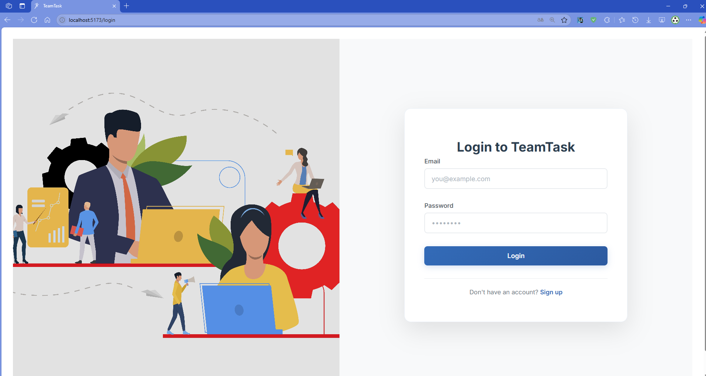
#### Page de connexion pour les utilisateurs et les managers. Les utilisateurs accèdent à leurs tâches personnelles, tandis que les managers accèdent à un tableau de bord de gestion.


### Signup page
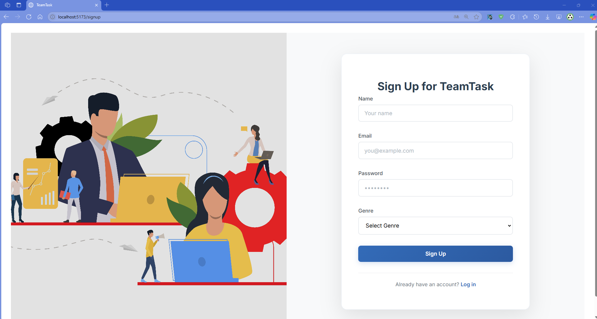
#### Page d'inscription destinée aux utilisateurs. Lorsqu’un utilisateur crée un compte, il obtient automatiquement le rôle "User".
Les comptes manager sont créés séparément (ex : par un autre manager via la page admin).


### My Tasks (vide) - côté utilisateur
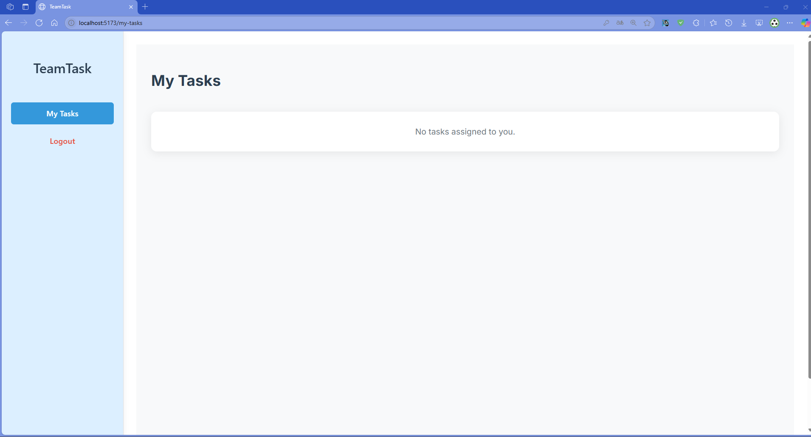
#### Vue de la page "Mes tâches" d’un utilisateur sans aucune tâche assignée pour le moment.

### Pages Manager (Administrateur) : 

### Manager Dashboard
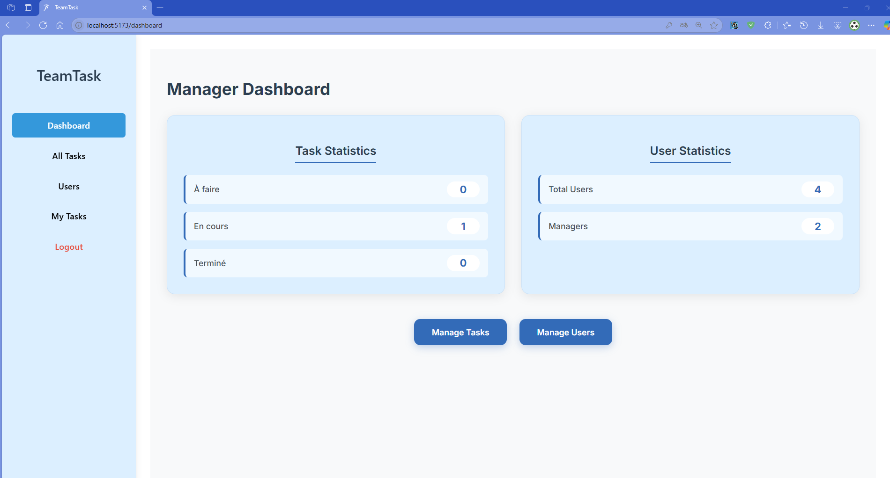
#### Tableau de bord du manager affichant des statistiques sur les tâches (à faire, en cours, terminées) ainsi que des statistiques sur les utilisateurs. Permet une navigation rapide vers la gestion des tâches et des utilisateurs.


### All Tasks (gestion des tâches)
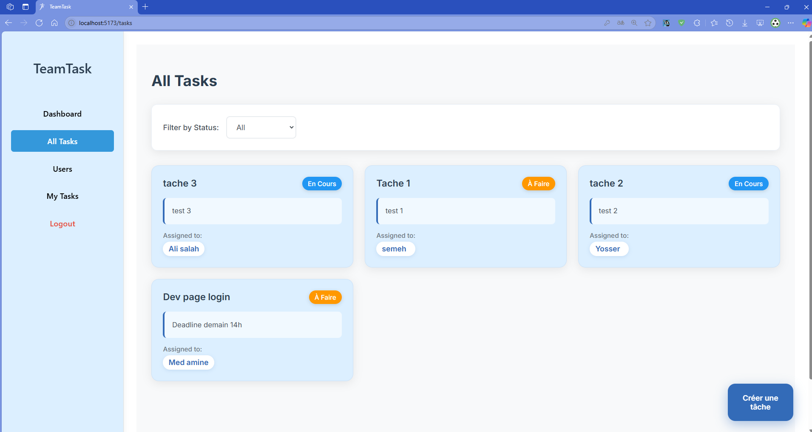
#### Interface permettant au manager de consulter toutes les tâches créées dans l'application. Il peut filtrer les tâches par statut, ou créer une nouvelle tâche.


### Filtrage des tâches par statut
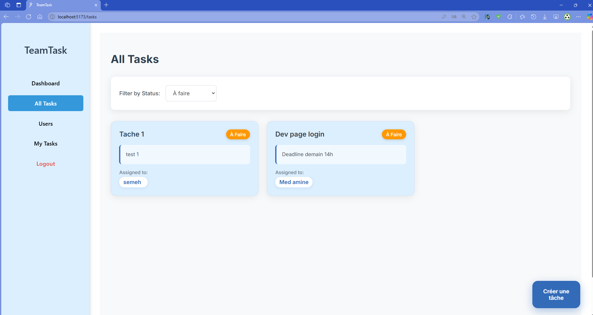
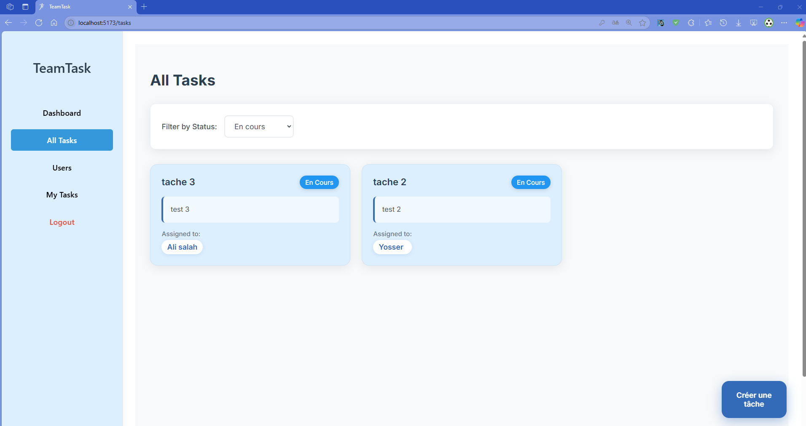
#### Exemple de filtre appliqué aux tâches : le manager peut afficher uniquement les tâches "en cours", "à faire" ou "terminées" pour une meilleure gestion.


### Popup de création de tâche
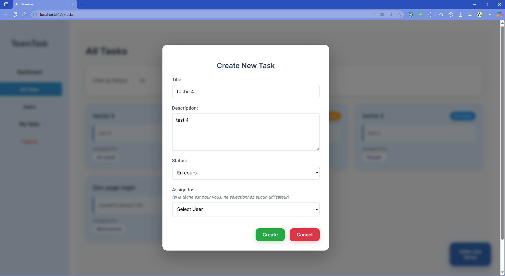
#### Fenêtre modale contenant un formulaire pour créer une nouvelle tâche et l’assigner à un utilisateur.
Si aucun utilisateur n’est sélectionné, la tâche sera automatiquement assignée au manager.


### Page des utilisateurs (Admin / Manager)
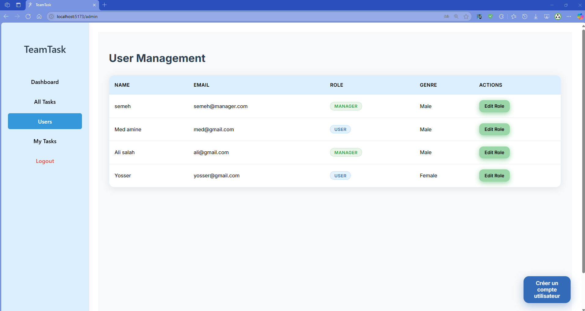
#### Liste de tous les utilisateurs de l’application (rôles : User et Manager). Seul un manager peut accéder à cette page pour gérer les comptes.


### Modification du rôle d’un utilisateur
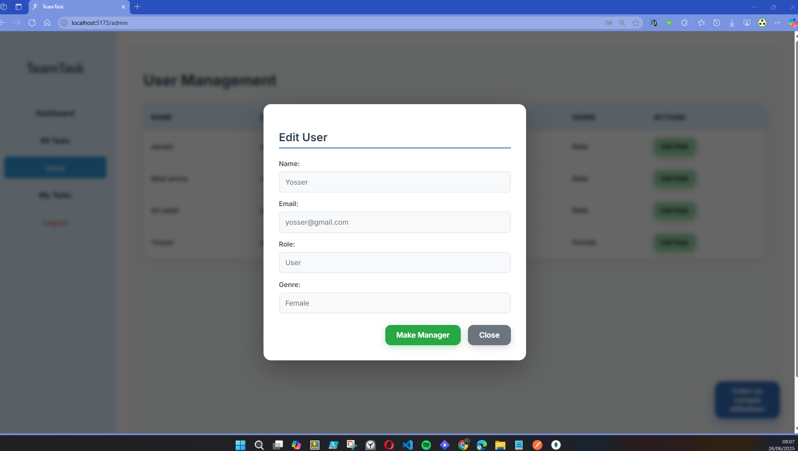
#### Le manager peut modifier le rôle d’un utilisateur standard et le promouvoir en manager. Les managers ne peuvent pas être rétrogradés.


### Rôle modifié avec succès
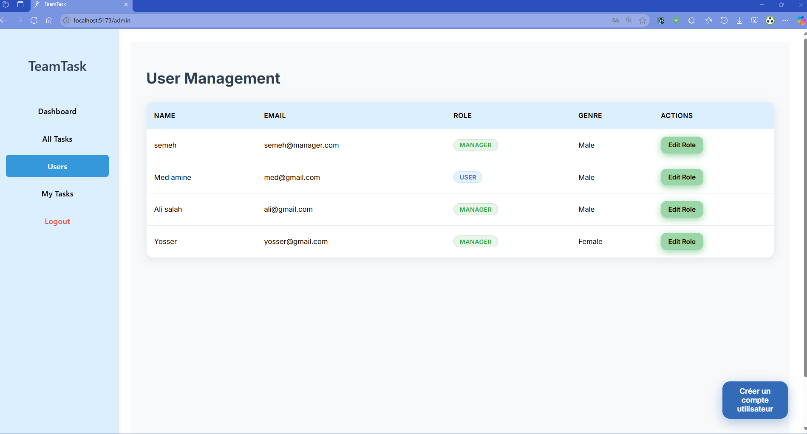
#### Confirmation que le rôle de l’utilisateur a bien été mis à jour avec succès.


### Popup de création d’un nouvel utilisateur
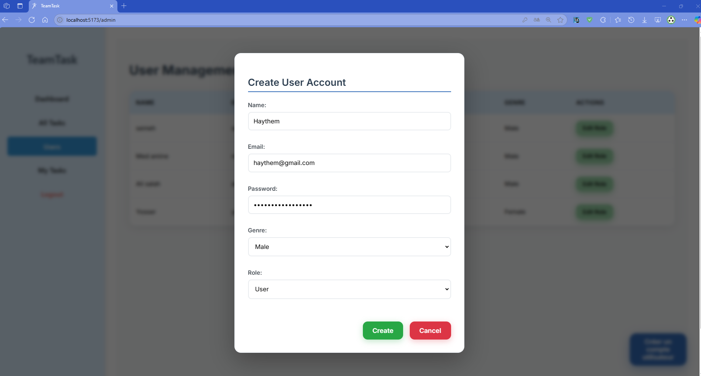
#### Fenêtre de création d’un utilisateur. Le manager peut choisir de créer un compte de type User ou Manager.


### My Tasks - côté manager et utilisateur

### My Tasks - Manager
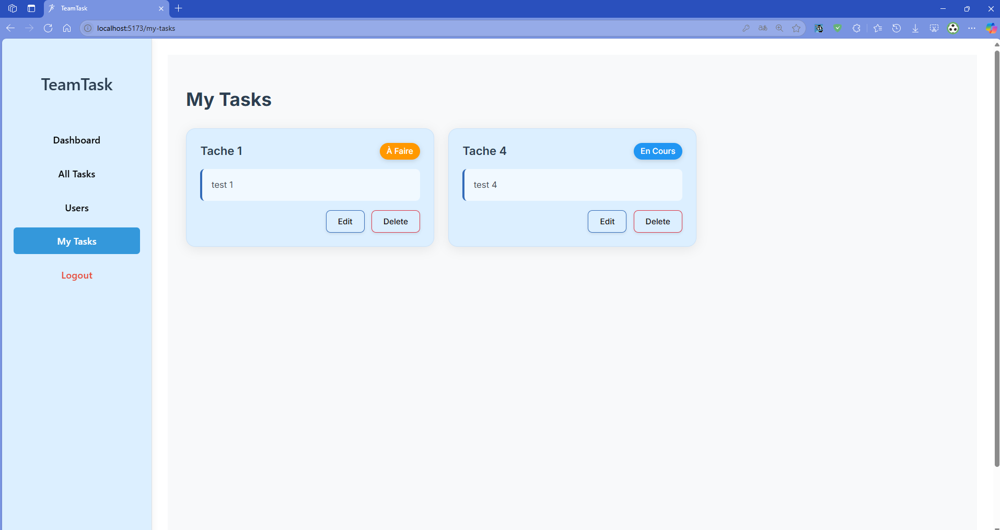
#### Le manager peut visualiser, modifier ou supprimer les tâches qu’il s’est attribuées à lui-même.

### My Tasks - Utilisateur
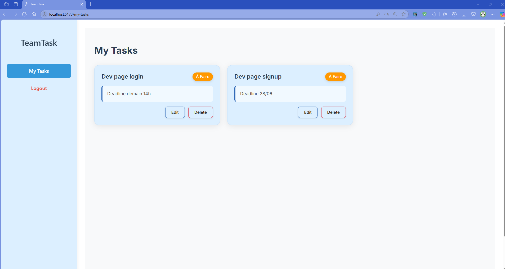
#### L’utilisateur voit maintenant les tâches qui lui ont été assignées. Il peut les consulter, mettre à jour leur statut ou les supprimer.


### Popup de modification du statut de la tâche
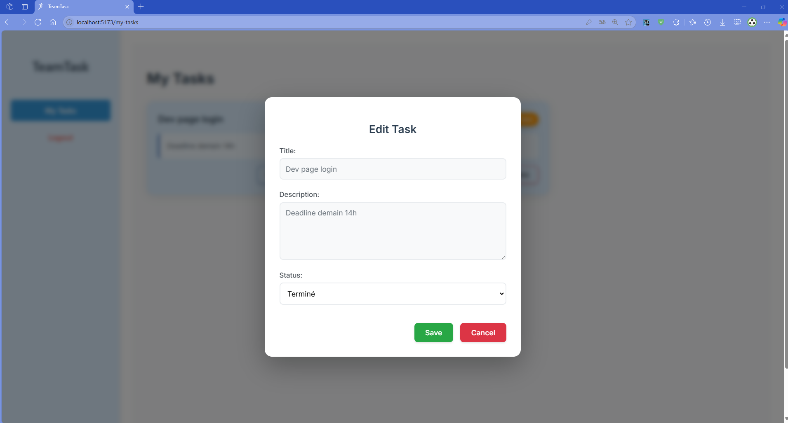
#### L’utilisateur (ou manager) peut modifier le statut de la tâche via cette fenêtre. Les statuts disponibles sont : à faire, en cours, terminé.


### Confirmation de suppression de tâche
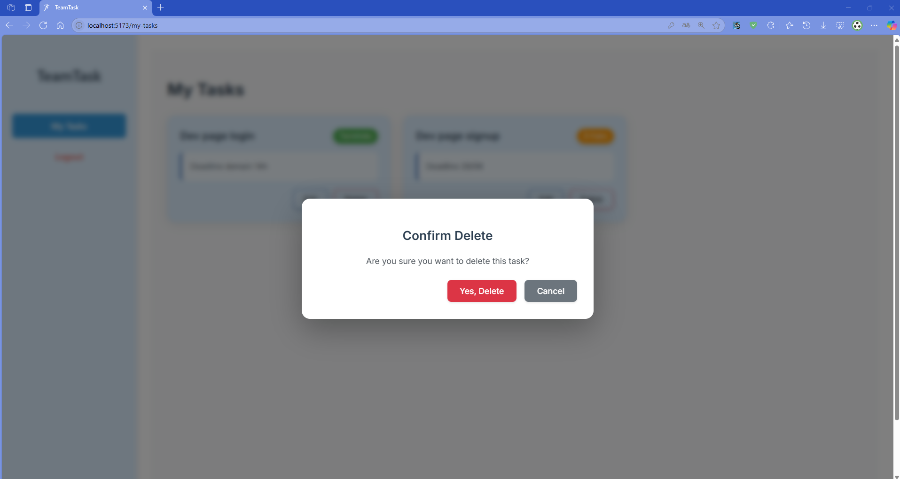
#### Fenêtre de confirmation avant la suppression d’une tâche. Disponible aussi bien pour les utilisateurs que les managers dans la section "Mes tâches".


### Tâche supprimée avec succès
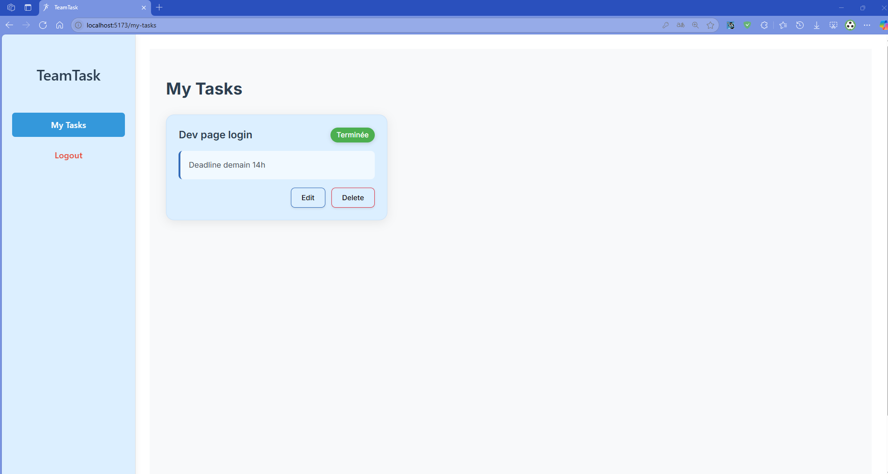
#### Tâche supprimée avec succès.
